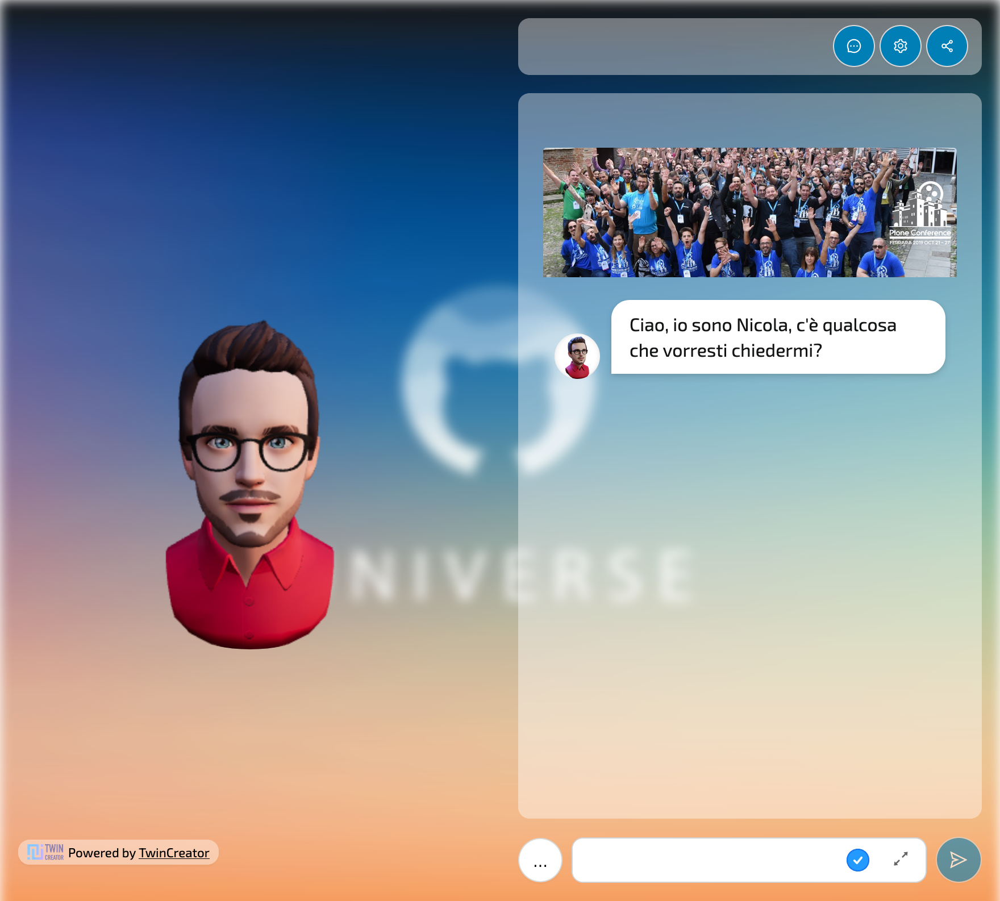
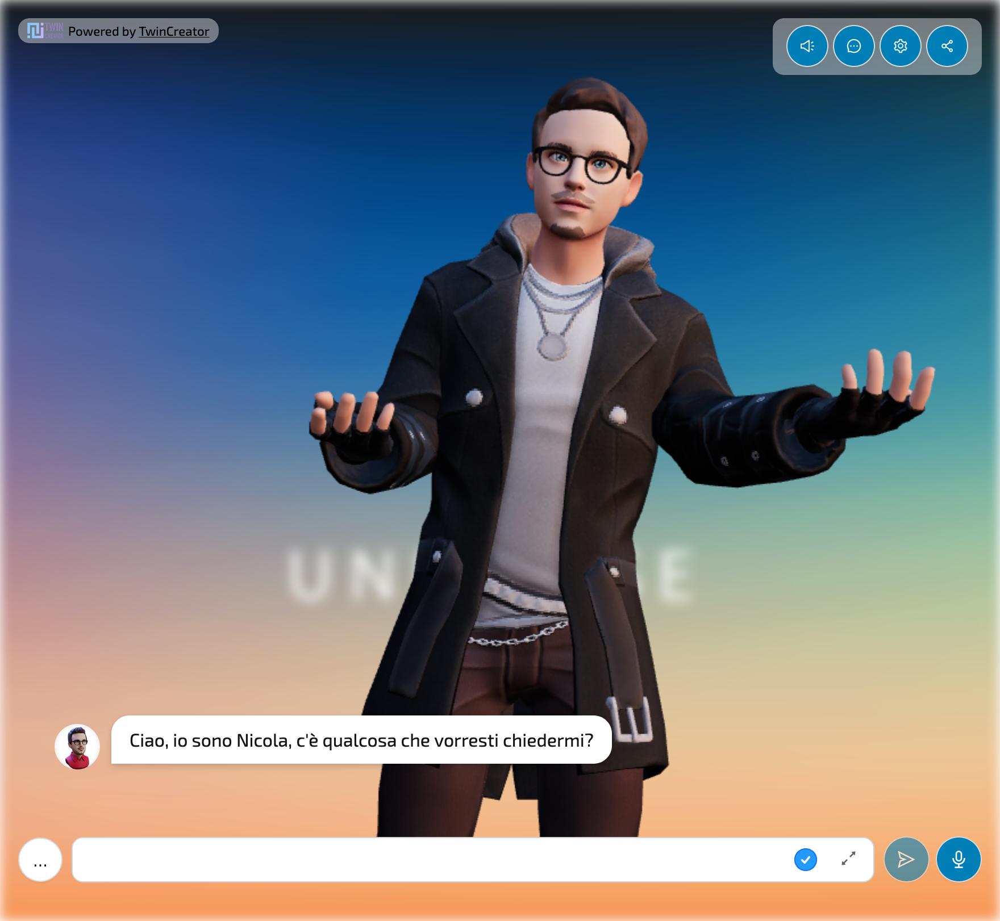
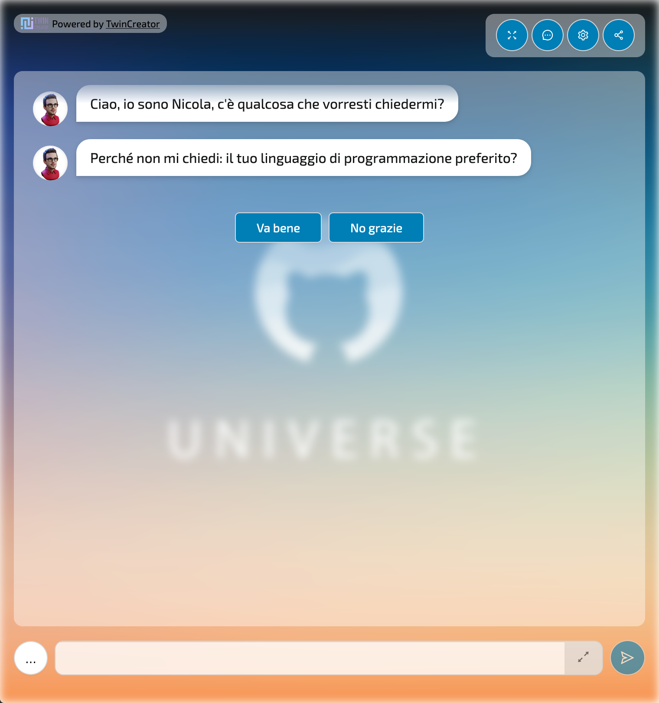
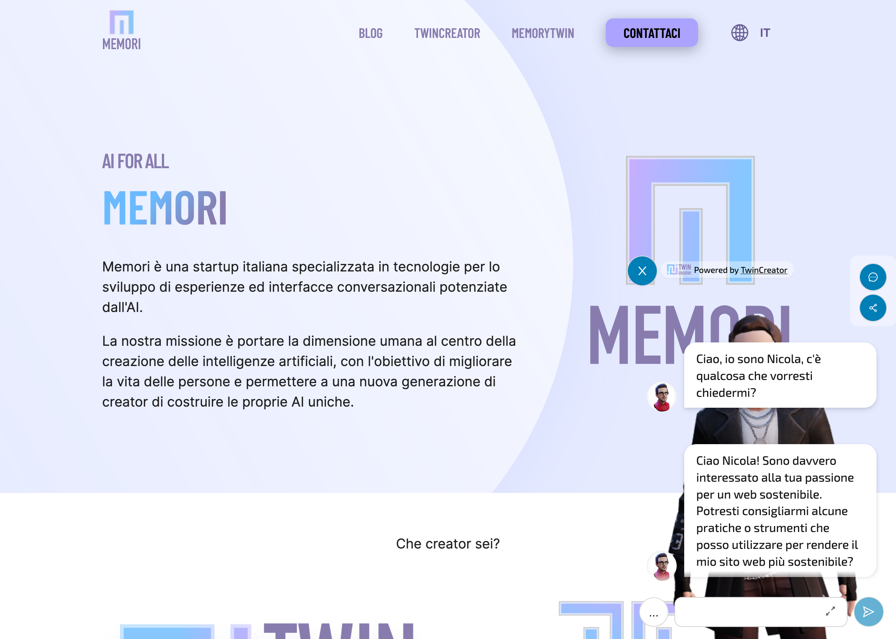
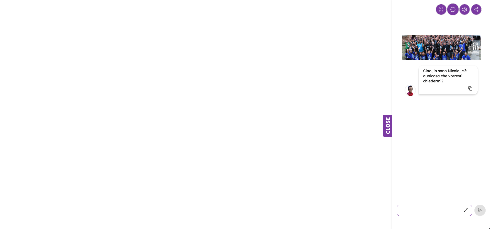
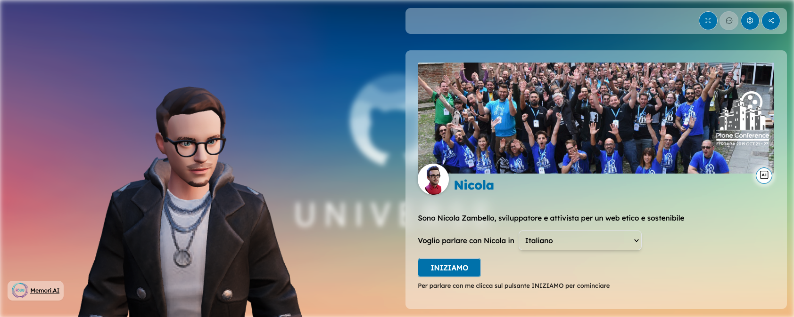

# Memori React

[](https://www.npmjs.com/package/@memori.ai/memori-react)


Library to integrate a Twin from [Memori](https://memori.ai) in a React app.

Web Platform: [AIsuru](https://aisuru.com)

## Installation

```bash
yarn add @memori.ai/memori-react
```

```bash
npm install @memori.ai/memori-react
```

## Usage

Import the component:

```tsx
import Memori from '@memori.ai/memori-react';
```

Import the CSS:

```tsx
import '@memori.ai/memori-react/dist/styles.css';
```

Then use it in your app:

```tsx
const App = () => (
  <Memori
    memoriName="Memori"
    ownerUserName="memoridev"
    tenantID="www.aisuru.com"
    apiURL="https://backend.memori.ai"
    engineURL="https://engine.memori.ai"
    baseURL="https://www.aisuru.com"
    uiLang="it"
    multilingual
    showShare
    height="100vh"
  />
);
```

### Props

| Prop                               | Required       | Type                                        | Default                     | Description                                                                                                                                                                                                                                                                                                                                                                                                                             |
| ---------------------------------- | -------------- | ------------------------------------------- | --------------------------- | --------------------------------------------------------------------------------------------------------------------------------------------------------------------------------------------------------------------------------------------------------------------------------------------------------------------------------------------------------------------------------------------------------------------------------------- |
| `memoriName`                       | \* (see below) | `string`                                    |                             | Name of the Memori                                                                                                                                                                                                                                                                                                                                                                                                                      |
| `ownerUserName`                    | \* (see below) | `string`                                    |                             | Username of the Memori owner                                                                                                                                                                                                                                                                                                                                                                                                            |
| `memoriID`                         | \* (see below) | `string`                                    |                             | ID of the Memori                                                                                                                                                                                                                                                                                                                                                                                                                        |
| `ownerUserID`                      | \* (see below) | `string`                                    |                             | ID of the Memori owner                                                                                                                                                                                                                                                                                                                                                                                                                  |
| `tenantID`                         | ✔️             | `string`                                    |                             | Tenant ID, example: "aisuru.com" or "app.memorytwin.com"                                                                                                                                                                                                                                                                                                                                                                                |
| `sessionID`                        |                | `string`                                    |                             | Initial Session ID, UUID which refers to the session to the Memori and identifies a conversation and its permissions (giver, receiver, anonymous). A session would be started autonomously with the params set, but if you have an existing and valid sessionID you can pass it as already opened one. Use this at your risk, as session recovery might break or start session as anon user. In most cases, you shoudn't use this prop. |
| `authToken`                        |                | `string`                                    |                             | Authentication token from user login, needed for giver sessions to upload assets                                                                                                                                                                                                                                                                                                                                                        |
| `integrationID`                    |                | `string`                                    |                             | Integration ID, UUID which refers to the public page layout                                                                                                                                                                                                                                                                                                                                                                             |
| `secretToken`                      |                | `string`                                    |                             | Secret token, the password of a private or secret Memori                                                                                                                                                                                                                                                                                                                                                                                |
| `height`                           |                | `string`                                    | "100%"                      | Height of the Memori                                                                                                                                                                                                                                                                                                                                                                                                                    |
| `showShare`                        |                | `bool`                                      | `true`                      | Show the share button                                                                                                                                                                                                                                                                                                                                                                                                                   |
| `showCopyButton`                   |                | `bool`                                      | `true`                      | Show the copy button on messages                                                                                                                                                                                                                                                                                                                                                                                                        |
| `showTranslationOriginal`          |                | `bool`                                      | `false`                     | Show button to see original text when translated                                                                                                                                                                                                                                                                                                                                                                                        |
| `showSettings`                     |                | `bool`                                      | `true`                      | Show the settings panel button                                                                                                                                                                                                                                                                                                                                                                                                          |
| `showTypingText`                   |                | `bool`                                      | `false`                     | Show default sentences while loading text (see: Typing stories)                                                                                                                                                                                                                                                                                                                                                                         |
| `showInstruct`                     |                | `bool`                                      | `false`                     | Show the switch selecting between test mode or instruct mode, needs an administrative session as a giver                                                                                                                                                                                                                                                                                                                                |
| `showLogin`                        |                | `bool`                                      | `true`                      | Show the login button                                                                                                                                                                                                                                                                                                                                                                                                                   |
| `showClear`                        |                | `bool`                                      | `false`                     | Show clear chat history button                                                                                                                                                                                                                                                                                                                                                                                                          |
| `showOnlyLastMessages`             |                | `bool`                                      | `true` or `false` \*        | Show only last 2 messages. (\*) Defaults to `true` for `TOTEM` and `WEBSITE_ASSISTANT` layouts, `false` otherwise                                                                                                                                                                                                                                                                                                                       |
| `baseURL`                          |                | `string`                                    |                             | Base URL of the Memori, example: "https://aisuru.com"                                                                                                                                                                                                                                                                                                                                                                                   |
| `apiURL`                           |                | `string`                                    | "https://backend.memori.ai" | URL of the Memori Backend API                                                                                                                                                                                                                                                                                                                                                                                                           |
| `engineURL`                        |                | `string`                                    | "https://engine.memori.ai"  | URL of the Memori Engine API                                                                                                                                                                                                                                                                                                                                                                                                            |
| `tag`                              |                | `string`                                    |                             | Tag of the person opening the session to the Memori, could be the giver or a receiver                                                                                                                                                                                                                                                                                                                                                   |
| `pin`                              |                | `string`                                    |                             | PIN of the person opening the session to the Memori, could be the giver or a receiver                                                                                                                                                                                                                                                                                                                                                   |
| `context`                          |                | `string`                                    |                             | Initial context of the conversation, dictionary with "key: value" pairs as context variables                                                                                                                                                                                                                                                                                                                                            |
| `initialQuestion`                  |                | `string`                                    |                             | Initial question to ask to the Memori, starts the conversation as this would be sent to the Memori                                                                                                                                                                                                                                                                                                                                      |
| `uiLang`                           |                | `'en' \| 'it' \| 'es' \| 'fr' \| 'de'`      | "en"                        | Language of the UI, es: "en" or "it"                                                                                                                                                                                                                                                                                                                                                                                                    |
| `multilingual`                     |                | `bool`                                      | `false`                     | Enable multilingual mode, if enabled the user can switch between spoken languages                                                                                                                                                                                                                                                                                                                                                       |
| `spokenLang`                       |                | `string`                                    |                             | Language of the spoken text, as defaults to user selection. Example: "en" or "it"                                                                                                                                                                                                                                                                                                                                                       |
| `onStateChange`                    |                | `function`                                  |                             | Callback function called when the state of the Memori changes                                                                                                                                                                                                                                                                                                                                                                           |
| `enableAudio`                      |                | `boolean`                                   | `true`                      | Enable audio output. Defaults to true if otherwise indicated by props or integration config.                                                                                                                                                                                                                                                                                                                                            |
| `defaultSpeakerActive`             |                | `boolean`                                   | `true`                      | Default value for the speaker activation                                                                                                                                                                                                                                                                                                                                                                                                |
| `disableTextEnteredEvents`         |                | `boolean`                                   | `false`                     | Disable MemoriTextEntered events listeners for `typeMessage` functions, useful to avoid issues with multiple widgets in page.                                                                                                                                                                                                                                                                                                           |
| `AZURE_COGNITIVE_SERVICES_TTS_KEY` |                | `string`                                    |                             | Azure Cognitive Services TTS key, used to generate the audio of the Memori and for STT recognition                                                                                                                                                                                                                                                                                                                                      |
| `layout`                           |                | `string`                                    |                             | Layout of the Memori, can be "FULLPAGE" (default), "CHAT", "WEBSITE_ASSISTANT", "TOTEM", "HIDDEN_CHAT" or "ZOOMED_FULL_BODY". see [below](#layouts)                                                                                                                                                                                                                                                                                        |
| `customLayout`                     |                | `React.FC<LayoutProps>`                     |                             | Custom layout component, see [below](#custom-layout)                                                                                                                                                                                                                                                                                                                                                                                    |
| `customMediaRenderer`              |                | `(mimeType: string) => JSX.Element \| null` |                             | Custom media renderer, see [below](#custom-media-renderer)                                                                                                                                                                                                                                                                                                                                                                              |
| `additionalSettings`               |                | `JSX.Element`                               |                             | Custom JSX or component to render within the settings drawer                                                                                                                                                                                                                                                                                                                                                                            |
| `userAvatar`                       |                | `string`                                    |                             | Custom URL or React element to use as user avatar                                                                                                                                                                                                                                                                                                                                                                                       |

\*: one of these pairs is required: `memoriName` + `ownerUserName`, `memoriID` + `ownerUserID`

### Layouts

The Memori can be displayed in five different layouts: `FULLPAGE`, `CHAT`, `WEBSITE_ASSISTANT`,`TOTEM`, `HIDDEN_CHAT` and `ZOOMED_FULL_BODY`.
If you don't specify a layout, the default one is `FULLPAGE`.

#### FULLPAGE



#### TOTEM



#### CHAT



#### WEBSITE_ASSISTANT



#### HIDDEN_CHAT



#### ZOOMED_FULL_BODY



#### Custom layout

You can override the default layout by passing a custom layout component to the `customLayout` prop.

The custom layout component must be a React functional component that accepts a [LayoutProps](https://github.com/memori-ai/memori-react/blob/a6e0de73f3610f763bcd8e28deb7626fea91f0d1/src/components/MemoriWidget/MemoriWidget.tsx#LL148C21-L148C21) object as props.

```tsx
import { LayoutProps } from '@memori.ai/memori-react/dist/components/MemoriWidget/MemoriWidget';

const MyCustomLayout: React.FC<LayoutProps> = ({
  Header,
  headerProps,
  Avatar,
  avatarProps,
  Chat,
  chatProps,
  StartPanel,
  startPanelProps,
  integrationStyle,
  integrationBackground,
  ChangeMode,
  changeModeProps,
  sessionId,
  hasUserActivatedSpeak,
  showInstruct = false,
  loading = false,
  poweredBy,
}) => (
  <>
    {integrationStyle}
    {integrationBackground}

    <Spin spinning={loading} className="memori-mycustom-layout">
      {poweredBy}

      <div className="memori-mycustom-layout--controls">
        {sessionId && hasUserActivatedSpeak && Chat && chatProps ? (
          <Chat {...chatProps} />
        ) : startPanelProps ? (
          <StartPanel {...startPanelProps} />
        ) : null}
      </div>
    </Spin>
  </>
);
```

And then pass it to the `customLayout` prop:

```tsx
  <Memori
    ...
    customLayout={MyCustomLayout}
  />
```

## Styling

You can override the default styles of the Memori by customizing the following CSS custom properties:

```css
memori-client,
#headlessui-portal-root,
.memori-widget {
  --memori-primary: rgb(102, 103, 171);
  --memori-primary-text: #fff;
  --memori-inner-content-pad: 1rem;
  --memori-inner-bg: transparent;
  --memori-chat-bubble-bg: #ffffff60;
  --memori-text-color: #000;
  --memori-button-bg: #fff;
  --memori-button-text: #000;
  --memori-button-padding: 0.5rem 1.5rem;
  --memori-button-border-color: #d9d9d9;
  --memori-button-radius: 5px;
  --memori-button-box-shadow: 0 2px 0 rgba(0, 0, 0, 0.02);
  --memori-blur-background: 0px;
  --memori-drawer--width: 100%;
  --memori-drawer--width--md: 80%;
  --memori-drawer--width--lg: 60%;
  --memori-modal--width: 100%;
  --memori-modal--width--md: 80%;
  --memori-error-color: #ff4d4f;
  --memori-button-disabled-bg: #f9f9f9;
}
```

You can review the default styles in the [styles.css](https://github.com/memori-ai/memori-react/blob/main/src/styles.css) file.

## Component overrides

When using the `customLayout` prop, you can also override the default components used by the client.

```tsx
const MyCustomChat: LayoutProps['Chat'] = ({ history, sendMessage }) => {
  const [message, setMessage] = React.useState('');

  ...
}

const MyCustomAvatar: LayoutProps['Avatar'] = (props) => {
  ...
}

const CustomLayout: React.FC<LayoutProps> = ({
  avatarProps,
  chatProps,
  StartPanel,
  startPanelProps,
  sessionId,
  hasUserActivatedSpeak,
  loading = false,
  poweredBy,
}) => (
  <>
    <Spin spinning={loading} className="memori-mycustom-layout">
      {poweredBy}

      <div className="memori-mycustom-layout--avatar">
        <MyCustomAvatar {...avatarProps} />
      </div>

      <div className="memori-mycustom-layout--controls">
        {sessionId && hasUserActivatedSpeak && Chat && chatProps ? (
          <MyCustomChat {...chatProps} />
        ) : startPanelProps ? (
          <StartPanel {...startPanelProps} />
        ) : null}
      </div>
    </Spin>
  </>
);
```

## Custom media renderer

You can override the default media renderer by passing a custom function to the `customMediaRenderer` prop.
This can override the default media renderer for all media types or just for a specific one.

You can also use this to extend the default media renderer with additional media types.

```tsx
<Memori
  ...
  customMediaRenderer={(mimeType: string) => {
    if (mimeType === 'custom/content-type') {
      return <MyCustomImageRenderer />;
    }

    return null;
  }}
/>
```

## Global utilities

When rendered, the Memori widget exposes some global functions that can be used to interact with the Memori.

### Get the state of the Twin

```js
let dialogState = getMemoriState();
let sessionID = getMemoriState().sessionID;
let dialogState = getMemoriState(myWidgetIntegrationId); // in case you have multiple widgets on the same page
```

Otherwise, you can achieve the same result manually by reading from the HTML code of the widget the attribute data-memori-engine-state.

```js
let dialogState = JSON.parse(
  document.querySelector('div[data-memori-engine-state]')?.dataset
    ?.memoriEngineState ?? '{}'
);
```

### Write and send a message to the Twin

Write and send a message to the Twin. You can use this method to send a message to the Twin, such as to continue a conversation with a specific message or following an action.

```js
typeMessage('Hello World!');
```

Additional parameters:

```js
const waitForPrevious = true; // waits for previous message to be read, default: true
const hidden = true; // message is not visible to the user, only the response is, default: false
const typingText = "Asking the unicorns' opinion..."; // text to show in the loader while the Twin is answering, defaults to none
typeMessage('Hello World!', waitForPrevious, hidden, typingText);
```

There is also an alias function that does not show the message sent to the user, but only the Twin's response:

```js
const waitForPrevious = true; // waits for previous message to be read, default: true
typeMessageHidden('Hello World!', waitForPrevious);

// alias to
typeMessage('Hello World!', waitForPrevious, true);
```

## Conversation state change event

The `onStateChange` prop allows you to listen to state changes in the Memori widget.

```jsx
<Memori
  ...
  onStateChange={(state) => {
    console.log('Memori state changed:', state);
  }}
/>
```

Or, you can listen to the `MemoriNewDialogState` event on the document:

```js
document.addEventListener('MemoriNewDialogState', e => {
  console.log('Memori state changed:', e.detail);
});
```

where `e.details` is the new state of the Memori. This is useful to use when working with [memori-webcomponent](https://github.com/memori-ai/memori-webcomponent).

## See also

- [memori-api-client](https://github.com/memori-ai/memori-api-client) - API client for Memori
- [memori-webcomponent](https://github.com/memori-ai/memori-webcomponent) - Web component for Memori, uses this library
