# Memori React

[](https://www.npmjs.com/package/@memori.ai/memori-react)


Library to integrate an Agent from [Memori](https://memori.ai) in a React app.

- Web Platform: [AIsuru](https://aisuru.com)
- Storybook (live demo of components and layouts): [memori-ai.github.io/memori-react](https://memori-ai.github.io/memori-react/)

<p>
  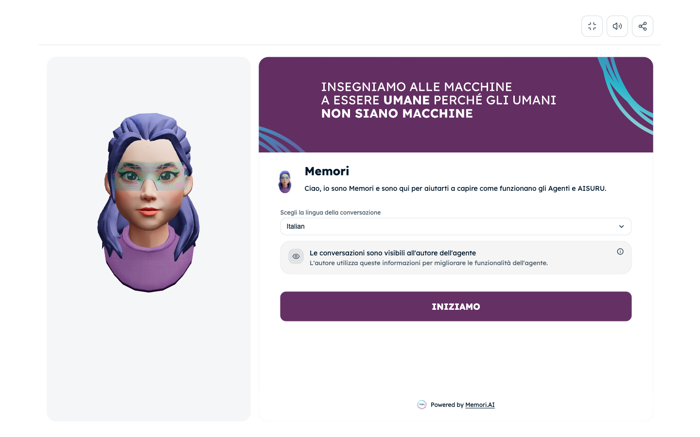
  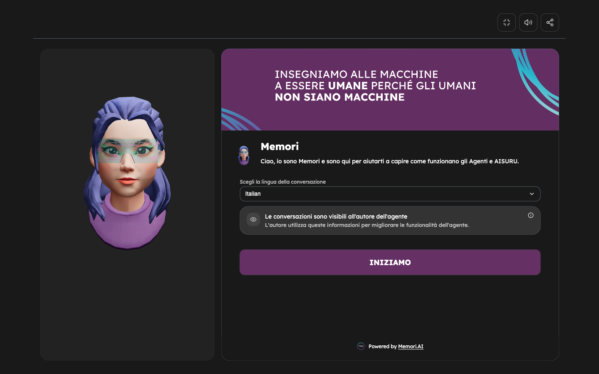
</p>

## Table of contents

- [Getting started](#getting-started)
  - [Requirements](#requirements)
  - [Installation](#installation)
  - [Quick start](#quick-start)
- [Configuration](#configuration)
  - [Props](#props)
  - [Integration config](#integration-config)
- [Layouts](#layouts)
  - [FULLPAGE](#fullpage)
  - [CHAT](#chat)
  - [WEBSITE_ASSISTANT](#website_assistant)
  - [HIDDEN_CHAT](#hidden_chat)
  - [TOTEM](#totem)
  - [ZOOMED_FULL_BODY](#zoomed_full_body)
  - [Mobile](#mobile)
- [Customization](#customization)
  - [Styling](#styling)
  - [Custom layout](#custom-layout)
  - [Component overrides](#component-overrides)
  - [Custom media renderer](#custom-media-renderer)
- [Features](#features)
  - [Chat history](#chat-history)
  - [Artifacts](#artifacts)
  - [PII detection](#pii-detection)
- [JavaScript API](#javascript-api)
  - [Conversation state](#conversation-state)
  - [Send messages programmatically](#send-messages-programmatically)
  - [DOM events](#dom-events)
  - [Artifact API](#artifact-api)
- [Development](#development)
- [See also](#see-also)
- [License](#license)

## Getting started

### Requirements

- React `>=16` (peer dependency)
- TypeScript `>=4.8` (peer dependency, optional)
- Node `>=16` for local development

### Installation

```bash
yarn add @memori.ai/memori-react
```

```bash
npm install @memori.ai/memori-react
```

### Quick start

Import the component and the CSS:

```tsx
import Memori from '@memori.ai/memori-react';
import '@memori.ai/memori-react/dist/styles.css';
```

Then use it in your app:

```tsx
const App = () => (
  <Memori
    memoriName="Memori"
    ownerUserName="memoridev"
    tenantID="www.aisuru.com"
    apiURL="https://backend.memori.ai"
    engineURL="https://engine.memori.ai"
    baseURL="https://www.aisuru.com"
    uiLang="it"
    multilingual
    showShare
    height="100vh"
  />
);
```

## Configuration

### Props

| Prop                       | Required       | Type                                        | Default                     | Description                                                                                                                                                                                                                                                                                                                                                                                                                             |
| -------------------------- | -------------- | ------------------------------------------- | --------------------------- | --------------------------------------------------------------------------------------------------------------------------------------------------------------------------------------------------------------------------------------------------------------------------------------------------------------------------------------------------------------------------------------------------------------------------------------- |
| `memoriName`               | \* (see below) | `string`                                    |                             | Name of the Memori                                                                                                                                                                                                                                                                                                                                                                                                                      |
| `ownerUserName`            | \* (see below) | `string`                                    |                             | Username of the Memori owner                                                                                                                                                                                                                                                                                                                                                                                                            |
| `memoriID`                 | \* (see below) | `string`                                    |                             | ID of the Memori (agent)                                                                                                                                                                                                                                                                                                                                                                                                                |
| `ownerUserID`              | \* (see below) | `string`                                    |                             | ID of the Memori owner                                                                                                                                                                                                                                                                                                                                                                                                                  |
| `tenantID`                 | ✔️             | `string`                                    |                             | Tenant ID, example: "aisuru.com" or "app.memorytwin.com"                                                                                                                                                                                                                                                                                                                                                                                |
| `sessionID`                |                | `string`                                    |                             | Initial Session ID, UUID which refers to the session to the Memori and identifies a conversation and its permissions (giver, receiver, anonymous). A session would be started autonomously with the params set, but if you have an existing and valid sessionID you can pass it as already opened one. Use this at your risk, as session recovery might break or start session as anon user. In most cases, you shoudn't use this prop. |
| `authToken`                |                | `string`                                    |                             | Authentication token from user login, needed for giver sessions to upload assets                                                                                                                                                                                                                                                                                                                                                        |
| `integrationID`            |                | `string`                                    |                             | Integration ID, UUID which refers to the public page layout                                                                                                                                                                                                                                                                                                                                                                             |
| `integration`              |                | `Integration`                               |                             | Integration object, see [Integration config](#integration-config)                                                                                                                                                                                                                                                                                                                                                                       |
| `secretToken`              |                | `string`                                    |                             | Secret token, the password of a private or secret Memori                                                                                                                                                                                                                                                                                                                                                                                |
| `height`                   |                | `string \| number`                          | "100%"                      | Height of the Memori. Pass `"100vh"` for a full-page fallback when the host has no definite height.                                                                                                                                                                                                                                                                                                                                     |
| `layout`                   |                | `string`                                    |                             | Layout of the Memori: `"FULLPAGE"` (default, alias `"DEFAULT"`), `"CHAT"`, `"WEBSITE_ASSISTANT"`, `"TOTEM"`, `"HIDDEN_CHAT"`, or `"ZOOMED_FULL_BODY"`. See [Layouts](#layouts).                                                                                                                                                                                                                                                       |
| `customLayout`             |                | `React.FC<LayoutProps>`                     |                             | Custom layout component, see [Custom layout](#custom-layout)                                                                                                                                                                                                                                                                                                                                                                            |
| `avatar3dHidden`           |                | `boolean`                                   | `true` for `WEBSITE_ASSISTANT` | Hide the 3D avatar. Defaults to `true` for the `WEBSITE_ASSISTANT` layout (expanded panel); set to `false` to show it there.                                                                                                                                                                                                                                                                                                         |
| `showShare`                |                | `bool`                                      | `true`                      | Show the share button                                                                                                                                                                                                                                                                                                                                                                                                                   |
| `showCopyButton`           |                | `bool`                                      | `true`                      | Show the copy button on messages                                                                                                                                                                                                                                                                                                                                                                                                        |
| `showTranslationOriginal`  |                | `bool`                                      | `false`                     | Show button to see original text when translated                                                                                                                                                                                                                                                                                                                                                                                        |
| `showSettings`             |                | `bool`                                      | `true`                      | Show the settings panel button                                                                                                                                                                                                                                                                                                                                                                                                          |
| `showChatHistory`          |                | `bool`                                      | `true`                      | Show the chat history drawer button (past sessions), see [Chat history](#chat-history). Can also be set via integration config.                                                                                                                                                                                                                                                                                                           |
| `showTypingText`           |                | `bool`                                      | `false`                     | Show default sentences while loading text (see: Typing stories)                                                                                                                                                                                                                                                                                                                                                                         |
| `showLogin`                |                | `bool`                                      | `true`                      | Show the login button                                                                                                                                                                                                                                                                                                                                                                                                                   |
| `showClear`                |                | `bool`                                      | `false`                     | Show clear chat history button                                                                                                                                                                                                                                                                                                                                                                                                          |
| `showOnlyLastMessages`     |                | `bool`                                      | `true` or `false` \*        | Show only last 2 messages. (\*) Defaults to `true` for `TOTEM` and `WEBSITE_ASSISTANT` layouts, `false` otherwise                                                                                                                                                                                                                                                                                                                       |
| `showInputs`               |                | `bool`                                      | `true`                      | Show the chat inputs (textarea, send and microphone buttons). Set to `false` for read-only / scripted conversations driven by `typeMessage`.                                                                                                                                                                                                                                                                                             |
| `showDates`                |                | `bool`                                      | `false`                     | Show the timestamp on the Agent's messages                                                                                                                                                                                                                                                                                                                                                                                              |
| `showContextPerLine`       |                | `bool`                                      | `false`                     | Show the context variables active for each message                                                                                                                                                                                                                                                                                                                                                                                      |
| `showMessageConsumption`   |                | `bool`                                      | `false`                     | Show the AI consumption (LLM usage) per message. Can also be set via integration config.                                                                                                                                                                                                                                                                                                                                                 |
| `showUpload`               |                | `bool`                                      | `true`                      | Show the upload button within the chat                                                                                                                                                                                                                                                                                                                                                                                                  |
| `showReasoning`            |                | `bool`                                      | `false`                     | Show reasoning output                                                                                                                                                                                                                                                                                                                                                                                                                   |
| `maxTotalMessagePayload`   |                | `number`                                    | 300000                      | Max **per-document** content length (character count). Kept for backward compatibility: it no longer applies to the sum of all attached documents.                                                                                                                                                                                                                                                                                      |
| `maxTextareaCharacters`    |                | `number`                                    |                             | Max characters allowed in the chat textarea. When set, shows a counter (e.g. "0 / 500") above the textarea, enforces the limit, and disables paste-as-attachment by default.                                                                                                                                                                                                                                                             |
| `baseURL`                  |                | `string`                                    |                             | Base URL of the Memori, example: "https://aisuru.com"                                                                                                                                                                                                                                                                                                                                                                                   |
| `apiURL`                   |                | `string`                                    | "https://backend.memori.ai" | URL of the Memori Backend API                                                                                                                                                                                                                                                                                                                                                                                                           |
| `engineURL`                |                | `string`                                    | "https://engine.memori.ai"  | URL of the Memori Engine API                                                                                                                                                                                                                                                                                                                                                                                                            |
| `tag`                      |                | `string`                                    |                             | Tag of the person opening the session to the Memori, could be the giver or a receiver                                                                                                                                                                                                                                                                                                                                                   |
| `pin`                      |                | `string`                                    |                             | PIN of the person opening the session to the Memori, could be the giver or a receiver                                                                                                                                                                                                                                                                                                                                                   |
| `context`                  |                | `{ [key: string]: string }`                 |                             | Initial context of the conversation, object of context variables, example: `{ SOURCE: 'website' }`. If omitted, `contextVars` from the integration config is used.                                                                                                                                                                                                                                                                       |
| `initialQuestion`          |                | `string`                                    |                             | Initial question to ask to the Memori, starts the conversation as this would be sent to the Memori                                                                                                                                                                                                                                                                                                                                      |
| `additionalInfo`           |                | `{ [key: string]: string }`                 |                             | Additional info sent when opening the session (`additionalInfo` of the Engine `openSession` call). A `loginToken` key here takes precedence over `authToken`.                                                                                                                                                                                                                                                                             |
| `autoStart`                |                | `boolean`                                   | `false` \*\*                | Automatically start the conversation when the component is mounted. (\*\*) Defaults to `true` for `HIDDEN_CHAT`; always `false` for `WEBSITE_ASSISTANT`.                                                                                                                                                                                                                                                                                 |
| `uiLang`                   |                | `'en' \| 'it' \| 'es' \| 'fr' \| 'de'`      | browser language            | Language of the UI, es: "en" or "it". Uppercase variants (`'IT'`, `'EN'`, ...) are accepted. Falls back to the browser language, then `"en"`.                                                                                                                                                                                                                                                                                             |
| `multilingual`             |                | `bool`                                      | `false`                     | Enable multilingual mode, if enabled the user can switch between spoken languages                                                                                                                                                                                                                                                                                                                                                       |
| `spokenLang`               |                | `string`                                    |                             | Language of the spoken text, as defaults to user selection. Example: "en" or "it"                                                                                                                                                                                                                                                                                                                                                       |
| `enableAudio`              |                | `boolean`                                   | `true`                      | Enable audio output. Defaults to true if otherwise indicated by props or integration config.                                                                                                                                                                                                                                                                                                                                            |
| `defaultSpeakerActive`     |                | `boolean`                                   | `true`                      | Default value for the speaker activation                                                                                                                                                                                                                                                                                                                                                                                                |
| `useMathFormatting`        |                | `boolean`                                   | `false`                     | Apply math formatting to the messages, defaults to false if otherwise indicated by props or integration config.                                                                                                                                                                                                                                                                                                                         |
| `onStateChange`            |                | `function`                                  |                             | Callback function called when the state of the Memori changes, see [Conversation state](#conversation-state)                                                                                                                                                                                                                                                                                                                            |
| `disableTextEnteredEvents` |                | `boolean`                                   | `false`                     | Disable MemoriTextEntered events listeners for `typeMessage` functions, useful to avoid issues with multiple widgets in page.                                                                                                                                                                                                                                                                                                           |
| `customMediaRenderer`      |                | `(mimeType: string) => JSX.Element \| null` |                             | Custom media renderer, see [Custom media renderer](#custom-media-renderer)                                                                                                                                                                                                                                                                                                                                                              |
| `additionalSettings`       |                | `JSX.Element`                               |                             | Custom JSX or component to render within the settings drawer                                                                                                                                                                                                                                                                                                                                                                            |
| `userAvatar`               |                | `string \| JSX.Element`                     |                             | Custom URL or React element to use as user avatar                                                                                                                                                                                                                                                                                                                                                                                       |
| `applyVarsToRoot`          |                | `boolean`                                   | `false`                     | Also apply the integration CSS variables (brand color, etc.) to `:root`, not only to the widget scopes. Useful when rendering Memori UI elements outside the widget container.                                                                                                                                                                                                                                                             |

\*: one of these pairs is required: `memoriName` + `ownerUserName`, `memoriID` + `ownerUserID`

### Integration config

An **integration** is the configuration of a public page / landing experience created from the Memori backend. You can pass it explicitly with the `integration` prop, or select one of the Memori's integrations with `integrationID` (if neither is set, the published `LANDING_EXPERIENCE` integration is used, when present).

The integration object has a `customData` string containing JSON. The keys read by the widget are:

| Key                       | Type                                         | Description                                                                                                                                   |
| ------------------------- | -------------------------------------------- | --------------------------------------------------------------------------------------------------------------------------------------------- |
| `layout`                  | `string \| { name, piiDetection? }`          | Layout name, or an object with `name` and a [PII detection](#pii-detection) config                                                            |
| `theme`                   | `'light' \| 'dark'`                          | Widget theme, see [Dark theme](#dark-theme). Default `light`                                                                                  |
| `lang`                    | `string`                                     | Default conversation language, used when the `spokenLang` prop is not set                                                                     |
| `uiLang`                  | `string`                                     | Fallback conversation language, after `lang`                                                                                                  |
| `buttonBgColor`           | `string`                                     | Brand primary color, injected as `--memori-primary-color`, see [Styling](#styling)                                                            |
| `buttonTextColor`         | `string`                                     | Text color on primary backgrounds, injected as `--memori-primary-content`                                                                     |
| `globalBackground`        | `string`                                     | URL of a background image for the chat                                                                                                        |
| `blurBackground`          | `boolean`                                    | Blur the global background behind the chat. Default `true`                                                                                    |
| `contextVars`             | `string`                                     | Initial context variables as `"KEY: value, KEY2: value2"`, used when the `context` prop is not set                                            |
| `initialQuestion`         | `string`                                     | Initial question, used when the `initialQuestion` prop is not set                                                                             |
| `showChatHistory`         | `boolean`                                    | Same as the prop                                                                                                                              |
| `showUpload`              | `boolean`                                    | Same as the prop                                                                                                                              |
| `showReasoning`           | `boolean`                                    | Same as the prop                                                                                                                              |
| `showMessageConsumption`  | `boolean`                                    | Same as the prop                                                                                                                              |
| `avatar_3d_hidden`        | `boolean`                                    | Same as the `avatar3dHidden` prop                                                                                                             |
| `totemContentMaxWidth`    | `number \| string`                           | `TOTEM` only: max-width of the content axis (avatar + panel + status), px or CSS length                                                       |
| `whiteListedDomains`      | `string[]`                                   | Regex list of hostnames allowed to render the widget (tenant name and aliases are always allowed). The widget renders nothing elsewhere       |
| `ignoreClientAttributes`  | `boolean`                                    | When `true`, the `show*`, `multilingual`, `enableAudio`, `defaultSpeakerActive`, `useMathFormatting`, `context`, `initialQuestion` and `tag`/`pin` props are ignored in favour of the integration values |

```tsx
const integration = {
  integrationID: '...',
  customData: JSON.stringify({
    layout: 'FULLPAGE',
    theme: 'dark',
    lang: 'it',
    buttonBgColor: '#6667ab',
    buttonTextColor: '#ffffff',
  }),
};

<Memori integration={integration} ... />
```

When a prop and the corresponding integration key are both set, the **prop wins** (unless `ignoreClientAttributes` is `true`).

## Layouts

The Memori can be displayed in six layouts: `FULLPAGE`, `CHAT`, `WEBSITE_ASSISTANT`, `HIDDEN_CHAT`, `TOTEM`, and `ZOOMED_FULL_BODY`. If you don't specify a layout (via the `layout` prop or via integration config), the default is `FULLPAGE`.

```tsx
// As a prop (takes precedence over the integration)
<Memori layout="CHAT" ... />

// Via integration config
const integration = {
  integrationID: '...',
  customData: JSON.stringify({ layout: 'CHAT' }),
};
<Memori integration={integration} ... />
```

All layouts support the light and dark [theme](#dark-theme).

### FULLPAGE

Two-column layout: 3D avatar on the left, start panel / chat on the right, with a branded header.

<p>
  
  
</p>

### CHAT

Chat only, no avatar. Header with chat history, fullscreen, audio, location, share and login controls; start panel as a central card.

<p>
  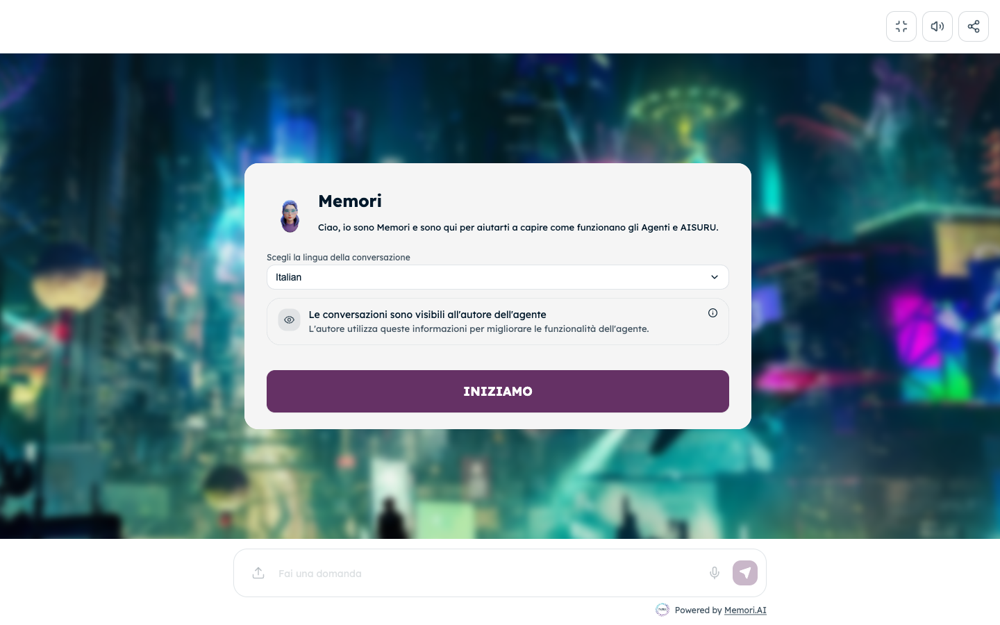
  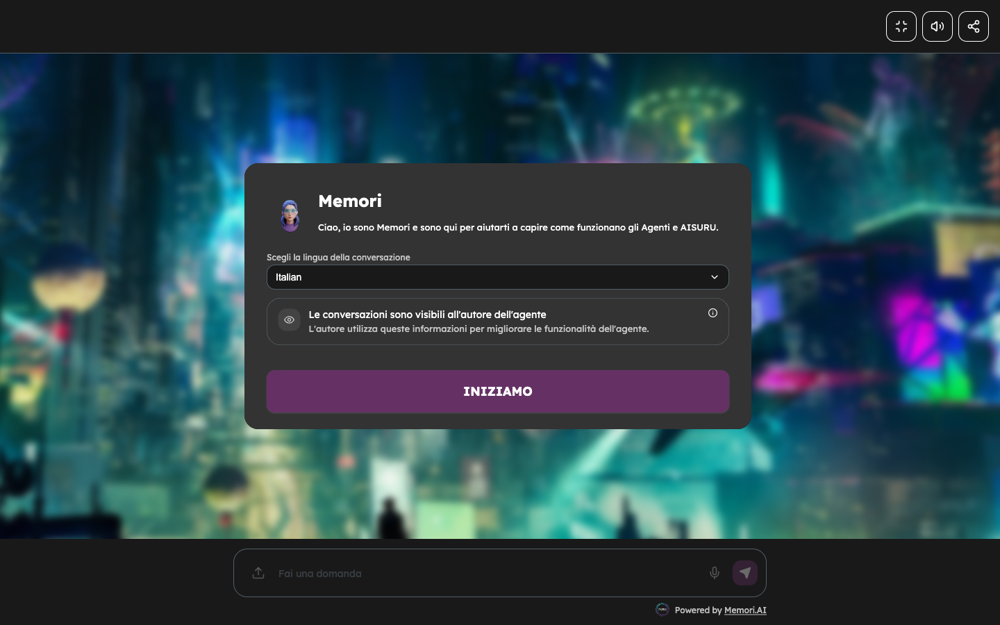
</p>

### WEBSITE_ASSISTANT

Floating launcher on the host page; the widget opens as a side panel with the start panel and the chat. The 3D avatar is hidden by default (`avatar3dHidden`). `autoStart` is always `false` and `showOnlyLastMessages` defaults to `true`.

<p>
  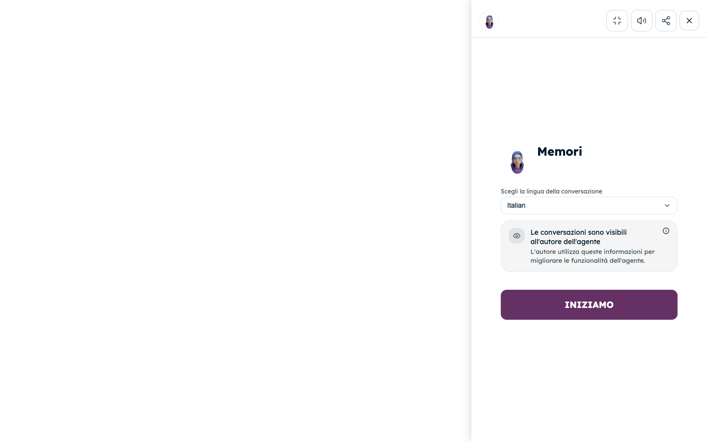
  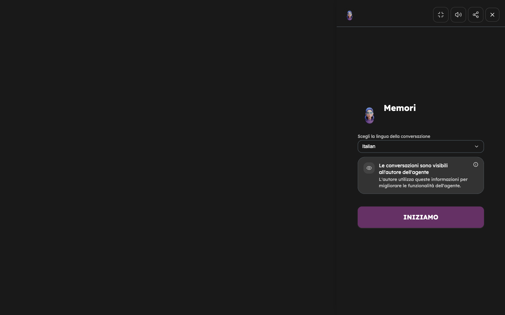
</p>

### HIDDEN_CHAT

Only the launcher is visible; the chat opens on demand as a compact sidebar. `autoStart` defaults to `true`.

<p>
  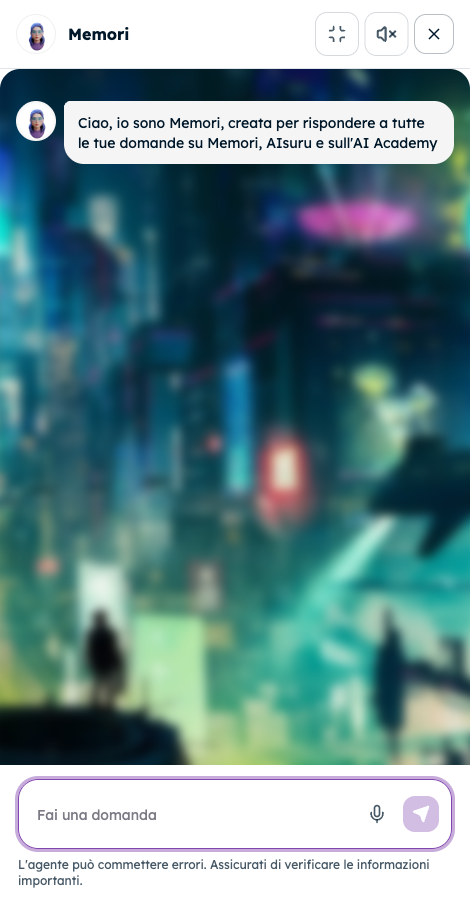
  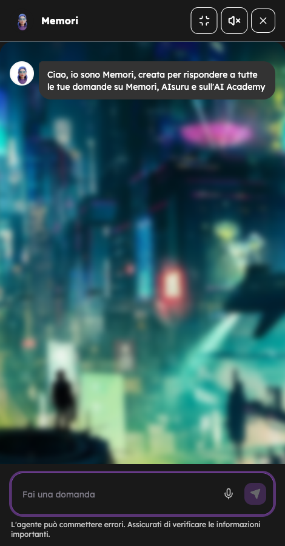
</p>

### TOTEM

Kiosk layout: full-body avatar with the start panel / chat card overlaid at the bottom and a vertical control bar. `showOnlyLastMessages` defaults to `true`. Use `totemContentMaxWidth` (integration config) to fit vertical screens.

<p>
  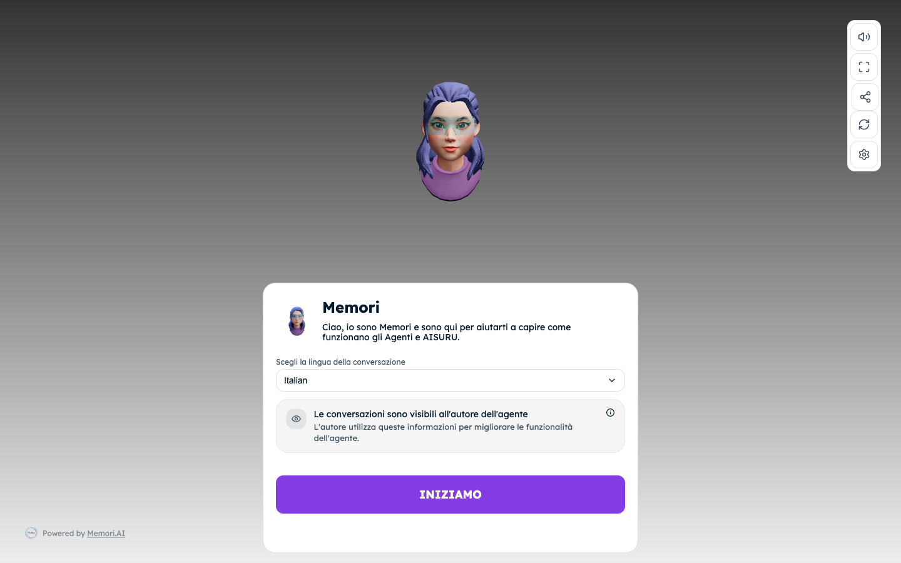
  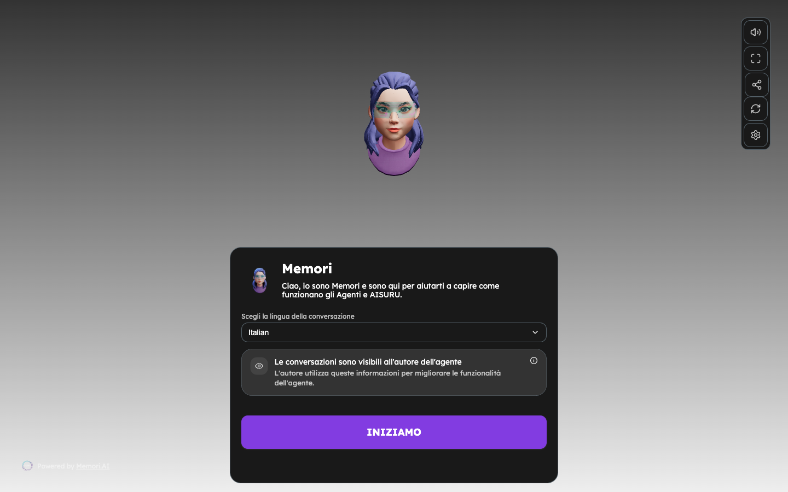
</p>

### ZOOMED_FULL_BODY

Full-body avatar zoomed in, chat overlaid.

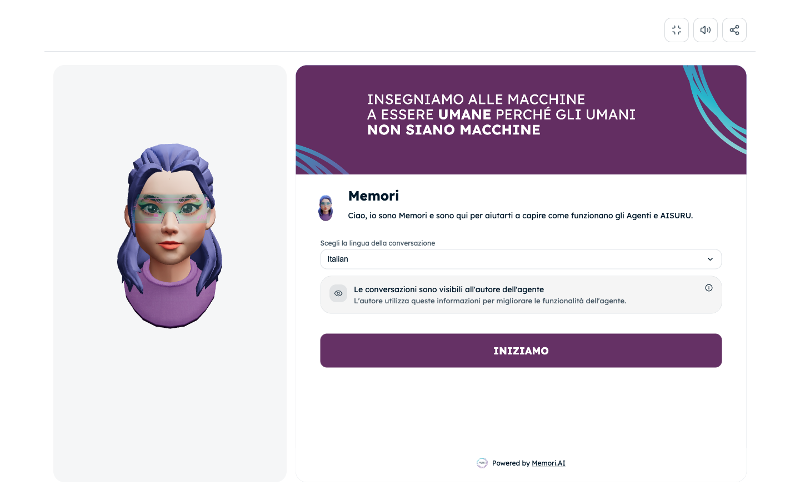

### Mobile

On small screens the header collapses to a compact bar (mute + menu); the menu opens a side panel with user info, session details and the navigation items (chat history, fullscreen, share, exit).

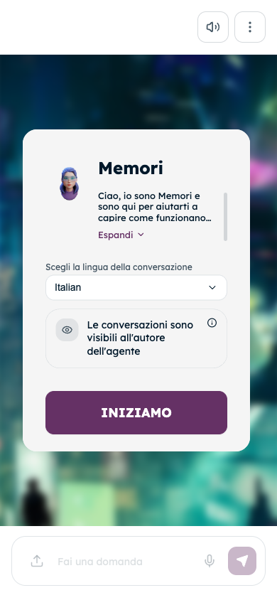

## Customization

### Styling

The widget is built on the [@memori.ai/ui](https://www.npmjs.com/package/@memori.ai/ui) design system and its CSS is organized in cascade layers, in this order: `memori.theme` < `memori.components` < `memori.overrides`. Your own overrides should live in `@layer memori.overrides` (or outside any layer, which always wins over layered styles).

#### Brand color

The main brand hook is `--memori-primary-color`. All primary-derived tokens (`hover`, `active`, `disabled`, `subtle`, borders, focus ring, shadows) are computed from it with `color-mix()`, so you usually only need to set this one:

```css
memori-client,
.memori-widget,
#headlessui-portal-root {
  --memori-primary-color: rgb(102, 103, 171);
  --memori-primary-content: #fff; /* text/icon color on primary backgrounds */
}
```

Set it on the widget scopes (`.memori-widget`, `memori-client`, portal roots), not only on `:root`: derived tokens are resolved where they are declared, so a `:root`-only override would leave disabled/subtle UI on the default brand. When an integration is passed, the widget already injects `buttonBgColor` / `buttonTextColor` from `customData` as these two variables (see `applyVarsToRoot` to also apply them to `:root`).

#### Design tokens

The most commonly used tokens you may override:

```css
.memori-widget {
  /* Brand */
  --memori-primary-color: rgb(130 70 175);
  --memori-primary-content: #fff;

  /* Surfaces & text */
  --memori-main-background: oklch(97.1% 0 0deg);
  --memori-secondary-background: oklch(100% 0 0deg);
  --memori-text-color: oklch(20% 0.05 240deg);
  --memori-border-color: color-mix(in oklch, oklch(45% 0.05 240deg), transparent 84%);

  /* Typography */
  --memori-font-family: 'Lexend Deca', sans-serif;
  --memori-text-size-sm: 0.875rem;
  --memori-text-size-md: 1rem;

  /* Shape & spacing */
  --memori-radius-control: 0.75rem; /* buttons, inputs */
  --memori-radius-surface: 1.25rem; /* cards, bubbles, drawers */
  --memori-spacing-xs: 4px;
  --memori-spacing-sm: 8px;
  --memori-spacing-md: 16px;
  --memori-spacing-lg: 24px;

  /* Layout */
  --memori-layout-max-width: 1280px;
  --memori-conversation-max-width: 48rem;
  --memori-conversation-inline-padding: var(--memori-spacing-md);

  /* Motion */
  --memori-motion-duration-fast: 0.15s;
  --memori-motion-duration-normal: 0.2s;
  --memori-motion-ease-out: cubic-bezier(0.33, 1, 0.68, 1);
}
```

Values shown are the light-theme defaults.

Derived tokens that are rebound automatically from `--memori-primary-color` (override only if you need a specific value): `--memori-primary`, `--memori-primary-hover`, `--memori-primary-active`, `--memori-primary-disabled`, `--memori-primary-subtle`, `--memori-primary-subtle-hover`, `--memori-primary-alpha`, `--memori-border-primary`, `--memori-border-primary-hover`, `--memori-focus-ring-color`, `--memori-focus-ring`, `--memori-shadow-primary`.

Semantic colors from `@memori.ai/ui`: `--memori-error`, `--memori-success`, `--memori-info`, `--memori-neutral`, `--memori-secondary`.

#### Dark theme

The theme is resolved from the integration config (`customData.theme: 'light' | 'dark'`, default `light`) and stamped as `data-theme` on the widget root and on portaled popups. You can also force it from the host:

```html
<div data-theme="dark">
  <!-- Memori widget here -->
</div>
```

Dark-specific primary-derived tokens are recomputed automatically; override them under `[data-theme='dark'] .memori-widget` if needed.

#### Reference

You can review the default styles and the full list of tokens in the [styles.css](https://github.com/memori-ai/memori-react/blob/main/src/styles.css) file and in the `@memori.ai/ui` stylesheet (`node_modules/@memori.ai/ui/dist/memori-ai-ui.css`). Per-component classes follow the `memori-<component>` naming (e.g. `.memori-chat--wrapper`, `.memori-chat--bubble`, `.memori-header`, `.memori--start-panel`); the widget root also gets `memori-layout-<layout>` and `memori-controls-<position>` modifiers.

### Custom layout

You can override the default layout by passing a custom layout component to the `customLayout` prop.

The custom layout component must be a React functional component that accepts a [LayoutProps](https://github.com/memori-ai/memori-react/blob/main/src/components/MemoriWidget/MemoriWidget.tsx) object as props (search for `export interface LayoutProps`).

Available `LayoutProps`:

| Prop                             | Type                        | Description                                                                             |
| -------------------------------- | --------------------------- | --------------------------------------------------------------------------------------- |
| `Header` / `headerProps`         | component / props           | Header with share, settings, chat history, login buttons                                |
| `Avatar` / `avatarProps`         | component / props           | 2D/3D avatar                                                                            |
| `Chat` / `chatProps`             | component / props           | Chat (history, inputs, attachments)                                                     |
| `StartPanel` / `startPanelProps` | component / props           | Panel shown before the session starts                                                   |
| `integrationStyle`               | `JSX.Element \| null`       | `<style>` element with integration CSS variables, render it once                        |
| `integrationBackground`          | `JSX.Element \| null`       | Background element from integration config                                              |
| `poweredBy`                      | `JSX.Element \| null`       | "Powered by" badge                                                                      |
| `sessionId`                      | `string`                    | Current session ID, `undefined` before the session starts                               |
| `hasUserActivatedSpeak`          | `boolean`                   | `true` once the user has started the conversation                                       |
| `showUpload`                     | `boolean`                   | Whether the upload button is enabled                                                    |
| `loading`                        | `boolean`                   | Widget is loading (session opening, memori loading)                                     |
| `autoStart`                      | `boolean`                   | Resolved `autoStart` value                                                              |
| `onSidebarToggle`                | `(isOpen: boolean) => void` | Callback to notify the widget when a sidebar is opened/closed                           |
| `avatar3dHidden`                 | `boolean \| string`         | Resolved `avatar3dHidden` value                                                         |
| `totemContentMaxWidth`           | `number \| string`          | `TOTEM` only: max-width of the content axis (avatar + panel + status), px or CSS length |

```tsx
import { Spin } from '@memori.ai/ui';
import { LayoutProps } from '@memori.ai/memori-react/dist/components/MemoriWidget/MemoriWidget';

const MyCustomLayout: React.FC<LayoutProps> = ({
  Header,
  headerProps,
  Avatar,
  avatarProps,
  Chat,
  chatProps,
  StartPanel,
  startPanelProps,
  integrationStyle,
  integrationBackground,
  sessionId,
  hasUserActivatedSpeak,
  loading = false,
  poweredBy,
}) => (
  <>
    {integrationStyle}
    {integrationBackground}

    <Spin spinning={loading} className="memori-mycustom-layout">
      {poweredBy}

      <div className="memori-mycustom-layout--controls">
        {sessionId && hasUserActivatedSpeak && Chat && chatProps ? (
          <Chat {...chatProps} />
        ) : startPanelProps ? (
          <StartPanel {...startPanelProps} />
        ) : null}
      </div>
    </Spin>
  </>
);
```

And then pass it to the `customLayout` prop:

```tsx
<Memori
  ...
  customLayout={MyCustomLayout}
/>
```

### Component overrides

When using the `customLayout` prop, you can also override the default components used by the client.

```tsx
const MyCustomChat: LayoutProps['Chat'] = ({ history, sendMessage }) => {
  const [message, setMessage] = React.useState('');

  ...
}

const MyCustomAvatar: LayoutProps['Avatar'] = (props) => {
  ...
}

const CustomLayout: React.FC<LayoutProps> = ({
  avatarProps,
  chatProps,
  StartPanel,
  startPanelProps,
  sessionId,
  hasUserActivatedSpeak,
  loading = false,
  poweredBy,
}) => (
  <>
    <Spin spinning={loading} className="memori-mycustom-layout">
      {poweredBy}

      <div className="memori-mycustom-layout--avatar">
        <MyCustomAvatar {...avatarProps} />
      </div>

      <div className="memori-mycustom-layout--controls">
        {sessionId && hasUserActivatedSpeak && Chat && chatProps ? (
          <MyCustomChat {...chatProps} />
        ) : startPanelProps ? (
          <StartPanel {...startPanelProps} />
        ) : null}
      </div>
    </Spin>
  </>
);
```

### Custom media renderer

You can override the default media renderer by passing a custom function to the `customMediaRenderer` prop.
This can override the default media renderer for all media types or just for a specific one.

You can also use this to extend the default media renderer with additional media types.

```tsx
<Memori
  ...
  customMediaRenderer={(mimeType: string) => {
    if (mimeType === 'custom/content-type') {
      return <MyCustomImageRenderer />;
    }

    return null;
  }}
/>
```

## Features

### Chat history

When `showChatHistory` is enabled (default), a side drawer lists the user's past conversations with the Agent, with filters, message count and attachments per chat. Selecting one resumes it in the chat.

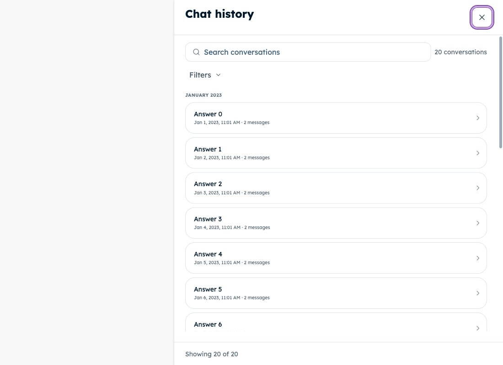

### Artifacts

When the Agent's answer contains an `<output>` element (code, HTML, markdown, JSON, ...), the widget renders it as an **artifact**: a card in the chat that opens in a dedicated drawer with preview, copy and download actions. On desktop the drawer is a resizable side column next to the chat; on mobile it takes the full width. Multiple versions of the same artifact are tracked together.

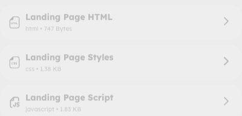

Artifacts can also be created from the host page, see [Artifact API](#artifact-api).

### PII detection

PII detection is **only available via integration config**: pass an integration whose `customData` JSON has `layout` as an object with `name` and `piiDetection`. It is not configurable via the `layout` prop.

When enabled, the widget checks each message (including attached document text) against the configured regex **rules** before sending. If any rule matches, the message is **not** sent and a single red error bubble is shown with the main `errorMessage` plus the matched rules' messages, in the chat's selected language (when `multilingual` is enabled).

**Config shape** (inside `integration.customData.layout.piiDetection`):

| Field          | Type      | Description                                                                                                                                                                                                          |
| -------------- | --------- | -------------------------------------------------------------------------------------------------------------------------------------------------------------------------------------------------------------------- |
| `enabled`      | `boolean` | When `true`, PII check runs before sending.                                                                                                                                                                          |
| `rules`        | `array`   | List of `{ id, label, pattern, message }`. `pattern` is a regex string; `message` is `{ [lang]: string }` (e.g. `{ it: "...", en: "..." }`). Rules with the same `id` are deduplicated in the error text.            |
| `errorMessage` | `object`  | Main line shown in the bubble: `{ [lang]: string }`.                                                                                                                                                                 |

**Example**:

```tsx
const integration = {
  integrationID: '...',
  customData: JSON.stringify({
    layout: {
      name: 'FULLPAGE',
      piiDetection: {
        enabled: true,
        rules: [
          {
            id: 'email',
            label: 'Email',
            pattern: '\\b[A-Za-z0-9._%+\\-]+@[A-Za-z0-9.\\-]+\\.[A-Za-z]{2,}\\b',
            message: { it: 'Contiene email.', en: 'Contains email.' },
          },
        ],
        errorMessage: { it: 'Dati sensibili.', en: 'Sensitive data.' },
      },
    },
    lang: 'it',
  }),
};

<Memori integration={integration} ... />
```

If both the `layout` prop and `integration.customData.layout` are provided, the `layout` prop wins for the layout name, while PII detection is still read from the integration.

Invalid or empty regex patterns are skipped; missing translations fall back to `en` then the first available value.

## JavaScript API

When rendered, the Memori widget exposes some global functions and DOM events that can be used to interact with the Agent from outside React.

### Conversation state

The `onStateChange` prop is called at every state change of the conversation:

```jsx
<Memori
  ...
  onStateChange={(state) => {
    console.log('Memori state changed:', state);
  }}
/>
```

The same state is dispatched as the `MemoriNewDialogState` event on `document` (useful when working with [memori-webcomponent](https://github.com/memori-ai/memori-webcomponent)):

```js
document.addEventListener('MemoriNewDialogState', e => {
  console.log('Memori state changed:', e.detail);
});
```

You can also read the current state at any time:

```js
let dialogState = getMemoriState();
let sessionID = getMemoriState().sessionID;
let dialogState = getMemoriState(myWidgetIntegrationId); // in case you have multiple widgets on the same page
```

Or manually, from the `data-memori-engine-state` attribute in the widget HTML:

```js
let dialogState = JSON.parse(
  document.querySelector('div[data-memori-engine-state]')?.dataset
    ?.memoriEngineState ?? '{}'
);
```

### Send messages programmatically

Write and send a message to the Agent, such as to continue a conversation with a specific message or following an action:

```js
typeMessage('Hello World!');
```

Additional parameters:

```js
const waitForPrevious = true; // waits for previous message to be read, default: true
const hidden = true; // message is not visible to the user, only the response is, default: false
const typingText = "Asking the unicorns' opinion..."; // text to show in the loader while the Agent is answering, defaults to none
const useLoaderTextAsMsg = false; // when true, the Agent's answer is replaced in the chat by typingText (useful for hidden "action" messages), default: false
typeMessage('Hello World!', waitForPrevious, hidden, typingText, useLoaderTextAsMsg);
```

There is also an alias function that does not show the message sent to the user, but only the Agent's response:

```js
const waitForPrevious = true; // waits for previous message to be read, default: true
typeMessageHidden('Hello World!', waitForPrevious, typingText, useLoaderTextAsMsg);

// alias to
typeMessage('Hello World!', waitForPrevious, true, typingText, useLoaderTextAsMsg);
```

`typeBatchMessages` sends a sequence of messages one after the other, waiting for the Agent to finish answering (and speaking) each one before sending the next. Chat inputs are disabled while the batch is running:

```js
typeBatchMessages([
  { message: 'Hello!', waitForPrevious: true },
  { message: 'Tell me about yourself', hidden: true, typingText: 'Thinking...' },
  { message: 'Thanks', useLoaderTextAsMsg: false },
]);
```

Each item accepts the same options as `typeMessage`: `message`, `waitForPrevious`, `hidden`, `typingText`, `useLoaderTextAsMsg`.

Set the `disableTextEnteredEvents` prop to `true` on widgets that should ignore these calls (e.g. when multiple widgets are on the same page).

### DOM events

The widget dispatches and listens to the following `CustomEvent`s on `document`:

| Event                  | Direction     | `event.detail`                                                                      | Description                                                                                       |
| ---------------------- | ------------- | ----------------------------------------------------------------------------------- | ------------------------------------------------------------------------------------------------- |
| `MemoriNewDialogState` | widget → host | `DialogState`                                                                       | Fired at every state change of the conversation, see [Conversation state](#conversation-state)    |
| `MemoriEndSpeak`       | widget → host | none                                                                                | Fired when the Agent has finished answering (and speaking, if audio is enabled)                   |
| `artifactCreated`      | widget → host | `{ artifact: ArtifactData, message: Message }`                                      | Fired when an artifact is generated from an Agent message, see [Artifact API](#artifact-api)      |
| `MemoriTextEntered`    | host → widget | `{ text, waitForPrevious, hidden, typingText, useLoaderTextAsMsg, hasBatchQueued }` | Sends a message to the Agent. This is what `typeMessage` dispatches under the hood                |
| `MemoriResetUIEffects` | host → widget | none                                                                                | Stops TTS playback and resets pending UI timers                                                   |

```js
document.addEventListener('MemoriEndSpeak', () => {
  console.log('Agent finished speaking');
});

document.addEventListener('artifactCreated', e => {
  console.log('New artifact:', e.detail.artifact);
});
```

### Artifact API

The Memori widget exposes a global `window.MemoriArtifactAPI` that allows you to programmatically create and control [artifacts](#artifacts) from external JavaScript code. This is particularly useful for integrating with WebSockets, Action Cable, or any scenario where you need to inject and display artifacts dynamically.

```javascript
// Create and open a simple artifact
window.MemoriArtifactAPI.createAndOpenArtifact(
  '<h1>Hello!</h1><p>This is my artifact</p>',
  'html',
  'My Artifact'
);

// Check current state
const state = window.MemoriArtifactAPI.getState();
console.log('Drawer open?', state.isDrawerOpen);
```

Available methods:

- `createAndOpenArtifact(content, mimeType?, title?)` - Create and open an artifact with simple parameters
- `openArtifact(artifact)` - Open an artifact with a complete `ArtifactData` object
- `createFromOutputElement(outputElement)` - Process a single `<output>` element from DOM, returns the artifact id
- `closeArtifact()` - Close the current artifact drawer
- `toggleFullscreen()` - Toggle fullscreen mode
- `getState()` - Get the current state of the artifact system: `{ currentArtifact, isDrawerOpen, isFullscreen, isChatLogPanelPresentation }`

`ArtifactData` shape:

```ts
interface ArtifactData {
  id: string; // unique id of this version
  artifactId: string; // stable id across versions of the same artifact
  content: string;
  mimeType: string; // e.g. 'html', 'markdown', 'javascript', 'json', ...
  title: string;
  timestamp: Date;
  size: number;
}
```

## Development

```bash
corepack enable && yarn install --immutable

yarn storybook   # run Storybook on http://localhost:6006
yarn test        # run tests in watch mode
yarn test:ci     # run tests once (CI)
yarn lint        # eslint + stylelint
yarn typecheck   # tsc --noEmit
yarn build       # build dist/ (CJS) and esm/ (ESM) + styles.css
```

Commits follow the [Conventional Commits](https://www.conventionalcommits.org/) spec (enforced by commitlint via husky); the [CHANGELOG](./CHANGELOG.md) is generated from them with release-it.

## See also

- [memori-api-client](https://github.com/memori-ai/memori-api-client) - API client for Memori
- [memori-webcomponent](https://github.com/memori-ai/memori-webcomponent) - Web component for Memori, uses this library
- [@memori.ai/ui](https://www.npmjs.com/package/@memori.ai/ui) - Design system used by this library

## License

[Apache-2.0](./LICENSE) © Memori Srl
